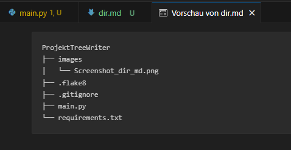

# ProjektTreeWriter – Verzeichnisgenerator mit `.gitignore` Unterstützung

*Hinweise zum Projekt:*
Dieses Projekt ist ein Lern- und Demonstrationsprojekt für alle, die an meiner Arbeitsweise interessiert sind. Besonderes Augenmerk habe ich auf den Einsatz rekursiver Funktionen und die Typisierung in Python gelegt.

## Inhaltsverzeichnis
- [Projektübersicht](#projektübersicht)
- [Merkmale](#merkmale)
- [Verwendete Technologien](#verwendete-technologien)
- [Installation & Ausführung](#installation--ausführung)
- [Lizenz](#lizenz)
- [Drittanbieter-Lizenzen](#drittanbieter-lizenzen)

---

## Projektübersicht
**ProjektTreeWriter** ist ein kleines Python-Tool, das eine übersichtliche Baumstruktur (`dir.md`) eines Verzeichnisses erstellt – ähnlich wie der Befehl `tree`, jedoch mit Unterstützung für `.gitignore`-Regeln und Markdown-Ausgabe.  

Das Programm nutzt rekursive Funktionen und Python-Typnotation. Aktuell (Version 0.5) wird die Datei `dir.md` im Verzeichnis erstellt, in dem das Programm ausgeführt wird. 
Zukünftige Versionen sollen benutzerdefinierte Regeln und die freie Wahl des Zielverzeichnisses ermöglichen.

---

## Merkmale
- Berücksichtigt `.gitignore`-Dateien und ignoriert entsprechend definierte Dateien/Ordner.
- Die Dateien `.gitignore` und `flake8` selbst werden **nicht** ignoriert.
- Erstellt eine verschachtelte Datenstruktur (Dictionary) für Verzeichnisse und Dateien.
- Gibt die Struktur als ASCII-Baum in einer Markdown-Datei (`dir.md`) aus.
- Ideal zur Dokumentation und schnellen Übersicht von Projekten.
  
---

## Verwendete Technologien
- Python 3.13.1
- [Pathspec](https://github.com/cpburnz/python-pathspec)
- [Flake8](https://flake8.pycqa.org/)
- [PyInstaller](https://www.pyinstaller.org/)

---

## Screenshot

<div style="text-align: center;">
  <b><br>Vorschau Beispiel in VS Code</b><br>
  <br>
  <div style="display: inline-block; max-width: 80%; margin: 5px auto; text-align: left;">
    <p>
      <strong>Beschreibung:</strong> Zu sehen ist die Vorschau der dir.md Datei in VS Code
    </p>
  </div>
</div>

---

## Installation & Ausführung

Es gibt zwei Möglichkeiten das Programm zu nutzen:
### 1. Ohne Installation als .exe Datei
- `zip`-Datei herunterladen und entpacken
- Download: [Netzwerkrechner.exe herunterladen](https://github.com/devZenger/ProjetTreeWriter/releases
- Netzwerkrechner.exe im Verzeichnis das dokumentiert werden soll ausführen

### 2. Quellcode herunterladen und ausführen
### Voraussetzungen

- Python 3.10 oder höher (getestet mit 3.13.1)
- `pip` (Python-Paketmanager)

### Installation

1. **Repository klonen**
````bash
git clone https://github.com/devZenger/ProjektTreeWriter.git
cd ProjektTreeWriter
````

2. **Abhängigkeiten installieren**
````bash
pip install -r requirements.txt
````
*(Alternativ: manuell installieren mit `pip install pathspec`)*

3. **Optional: Kompilieren als ausführbare Datei (z.B. für Windows)**
   Dazu muss zusätzlich pysinstaller installiert werden.
````bash
pip install pyinstaller
````
danach kann eine `.exe` erzeugt werden mit
````bash
pyinstaller --onefile main.py
````


### Ausführung
````bash
- **Standard-Nutzung**
python main.py
````


Die Datei `dir.md` wird im aktuellen Verzeichnis erstellt.


---

## Lizenz

Copyright (c) 2025 Christian Zenger  
GitHub: https://github.com/devZenger/ProjektTreeWriter

Dieses Projekt steht unter der **MIT-Lizenz** und darf gerne weiterverwendet oder angepasst werden – natürlich unter Einhaltung der Lizenzbedingungen.  
Es wurde mit viel Lernfreude und Neugier zu Übungs- und Demonstrationszwecken entwickelt.  
Wenn du Feedback, Fragen oder Ideen hast, freue ich mich über eine Nachricht.

## Verwendete Drittanbieter-Technologien
- **Python 3.13.1** – [PSF License](https://docs.python.org/3/license.html)
- **Pathspec** – [Mozilla Public License Version 2.0](https://github.com/cpburnz/python-pathspec?tab=MPL-2.0-1-ov-file#readme)
- **PyInstaller** – [GPL v2 License](https://pypi.org/search/?c=License+%3A%3A+OSI+Approved+%3A%3A+GNU+General+Public+License+v2+%28GPLv2%29)
- **Flake8** – [MIT License](https://github.com/PyCQA/flake8/blob/main/LICENSE)
